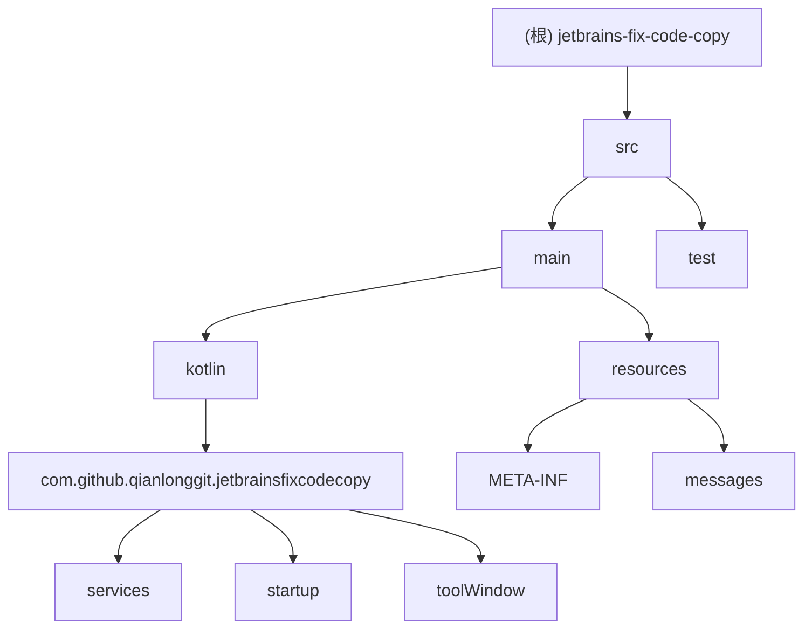

# JetBrains Fix Code Copy - AI 上下文文档

## 项目愿景

这是一个 JetBrains IDE 插件，旨在提升开发者与 AI 编码工具（如 Claude Code）的协作效率。当代码编辑器中出现错误时，插件会在代码操作菜单（Alt+Enter）中提供"复制修复 Prompt"选项，一键生成结构化的修复提示并复制到剪贴板，方便快速将问题传递给 AI 工具进行修复。

## 架构总览

### 模块结构图



### 技术栈
- **语言**: Kotlin
- **框架**: IntelliJ Platform SDK
- **构建工具**: Gradle (with Kotlin DSL)
- **Java 版本**: 21
- **目标平台**: IntelliJ IDEA 2025.2.5+

## 模块索引

| 模块路径 | 职责 | 状态 |
|---------|------|------|
| `src/main/kotlin/com.github.qianlonggit.jetbrainsfixcodecopy` | 插件主包 | 模板代码 |
| `src/main/kotlin/com.github.qianlonggit.jetbrainsfixcodecopy.services` | 项目级服务实现 | 模板代码 |
| `src/main/kotlin/com.github.qianlonggit.jetbrainsfixcodecopy.startup` | 插件启动活动 | 模板代码 |
| `src/main/kotlin/com.github.qianlonggit.jetbrainsfixcodecopy.toolWindow` | 工具窗口实现 | 模板代码 |
| `src/main/resources/META-INF` | 插件配置和清单 | 需要配置 |
| `src/test/kotlin` | 单元测试 | 模板代码 |

## 运行与开发

### 开发环境设置
1. **IDE 要求**: IntelliJ IDEA 2025.2.5 或更高版本
2. **JDK**: Java 21
3. **插件开发插件**: 确保安装了 "Plugin DevKit" 插件

### 构建和运行
```bash
# 构建插件
./gradlew buildPlugin

# 运行调试实例
./gradlew runIde

# 运行测试
./gradlew test

# 验证插件
./gradlew verifyPlugin
```

### 部署配置
- **插件组**: `com.github.qianlonggit.jetbrainsfixcodecopy`
- **插件 ID**: `com.github.qianlonggit.jetbrainsfixcodecopy`
- **版本**: 0.0.1
- **最低支持版本**: build 252

## 测试策略

### 测试层级
1. **单元测试**: 使用 JUnit 4
2. **集成测试**: 使用 IntelliJ Platform 测试框架
3. **UI 测试**: 使用 Robot Server 框架
4. **插件验证**: 使用 Plugin Verifier

### 测试覆盖
- 目标覆盖率：80%+
- 使用 Kover 进行覆盖率报告
- 集成 Codecov 进行 CI/CD 覆盖率跟踪

## 编码规范

### Kotlin 编码规范
1. 遵循官方 Kotlin 编码约定
2. 使用 4 空格缩进
3. 类名使用 PascalCase
4. 函数和变量使用 camelCase
5. 常量使用 UPPER_SNAKE_CASE

### 插件开发规范
1. **扩展点注册**: 在 `plugin.xml` 中正确声明
2. **服务注册**: 使用适当的 `@Service` 注解
3. **异步操作**: 使用 EDT 和后台线程正确处理
4. **资源管理**: 使用 `Disposer` 管理资源生命周期

## AI 使用指引

### 核心功能实现
插件需要实现以下核心功能：

1. **错误诊断监听**: 监听代码错误和警告
2. **意图动作注册**: 在 Alt+Enter 菜单中添加"复制修复 Prompt"选项
3. **Prompt 生成**: 根据以下模板生成修复提示：
   ```
   修复文件路径 ${filePath} 中 ${startLine}-${endLine} 行的代码问题
   ${diagnosticText}
   ${userInput}

   ```
   ${selectedText}
   ```
   ```
4. **剪贴板操作**: 将生成的 Prompt 复制到系统剪贴板

### 开发提示
- 使用 `IntentionAction` 实现自定义意图动作
- 通过 `Diagnostics` 获取错误信息
- 使用 `CopyPasteManager` 操作剪贴板
- 确保在正确的线程上执行操作

## 变更记录 (Changelog)

### 2025-12-13 14:38:49
- 初始化 AI 上下文文档
- 分析项目结构，识别模板代码
- 制定开发计划和架构设计
